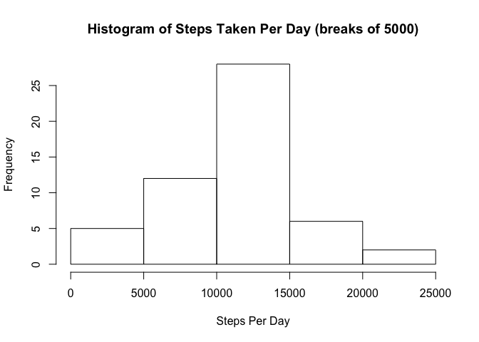
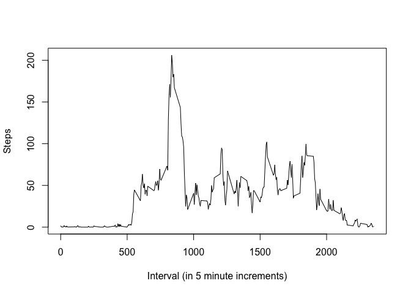
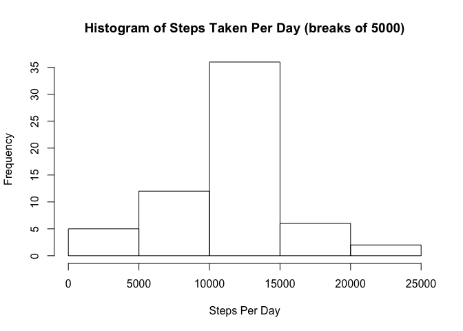
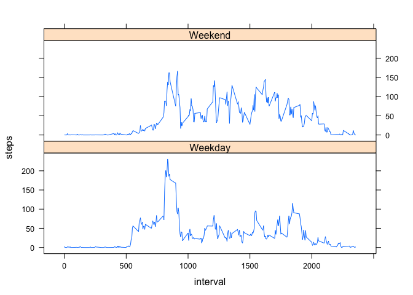

# Reproducible Research: Peer Assessment 1
Benjamin Hicks  


## Loading and preprocessing the data

The code for this analysis assumes that `activity.zip` is located in the local
git repo and then uses R's functions to extract it and load the csv to a data
frame


```r
knitr::opts_chunk$set(fig.path = "figure/")

setwd('~/RepData_PeerAssessment1/')
unzip('activity.zip')
fitness_df <- read.csv('activity.csv')
fitness_df <-na.omit(fitness_df) # omit NAs for now, unecessary because of how
                                 # aggregate functions but to be safe.
```

This produces a data frame with the following fields.


```r
head(fitness_df)
```

```
##     steps       date interval
## 289     0 2012-10-02        0
## 290     0 2012-10-02        5
## 291     0 2012-10-02       10
## 292     0 2012-10-02       15
## 293     0 2012-10-02       20
## 294     0 2012-10-02       25
```

```r
summary(fitness_df)
```

```
##      steps                date          interval     
##  Min.   :  0.00   2012-10-02:  288   Min.   :   0.0  
##  1st Qu.:  0.00   2012-10-03:  288   1st Qu.: 588.8  
##  Median :  0.00   2012-10-04:  288   Median :1177.5  
##  Mean   : 37.38   2012-10-05:  288   Mean   :1177.5  
##  3rd Qu.: 12.00   2012-10-06:  288   3rd Qu.:1766.2  
##  Max.   :806.00   2012-10-07:  288   Max.   :2355.0  
##                   (Other)   :13536
```


## What is mean total number of steps taken per day?

Producing a histogram requires getting all of the days in question by date 
and then creating sums of the total steps in each. I use the base R `aggregate`


```r
steps_day_df <- aggregate(steps~date, sum, data=fitness_df)
head(steps_day_df)
```

```
##         date steps
## 1 2012-10-02   126
## 2 2012-10-03 11352
## 3 2012-10-04 12116
## 4 2012-10-05 13294
## 5 2012-10-06 15420
## 6 2012-10-07 11015
```

Some days had no data, so they are **not** included as imputed data points per 
instructions.

This produces a histogram as follows.

```r
hist(steps_day_df$steps, xlab='Steps Per Day', main='Histogram of Steps Taken Per Day (breaks of 5000)')
```

<!-- -->

We see a peak between 10,000 - 15,000 steps per day. 


```r
mean_val <- round(mean(steps_day_df$steps))
med_val <- median(steps_day_df$steps)
```

This produced a mean of 10766 and median of 10765.

## What is the average daily activity pattern?

To produce these values, we need to average all rows that have the same interval
and then aggregate.


```r
mean_steps_interval <- aggregate(steps~interval, mean, data=fitness_df)
summary(mean_steps_interval)
```

```
##     interval          steps        
##  Min.   :   0.0   Min.   :  0.000  
##  1st Qu.: 588.8   1st Qu.:  2.486  
##  Median :1177.5   Median : 34.113  
##  Mean   :1177.5   Mean   : 37.383  
##  3rd Qu.:1766.2   3rd Qu.: 52.835  
##  Max.   :2355.0   Max.   :206.170
```

```r
plot(mean_steps_interval, type='l', ylab='Steps', 
     xlab='Interval (in 5 minute increments)')
```

<!-- -->

The time series plot clearly shows a peak approaching 1000 minutes. To confirm:

```r
mean_steps_interval[which(mean_steps_interval$steps == 
                          max(mean_steps_interval$steps)),]
```

```
##     interval    steps
## 104      835 206.1698
```

The most steps occur on interval 835, which is around 14:00 PM.

## Imputing missing values
The original data set has several rows with `NA`s for readings. This is probably 
skewing the statistics above. I therefore impute values for intervals based on
medians for a particular interval.


```r
fitness_df <- read.csv('activity.csv') # Now with NAs
sum(is.na(fitness_df$steps))
```

```
## [1] 2304
```

Using the data frame of means steps per interval recreated above, I impute any
NAs with the mean number of steps for that interval.


```r
imputed_df <- fitness_df
imputed_df$steps <- sapply(seq(1, nrow(fitness_df)), function (i) {
    if (is.na(fitness_df[i,1])) {
        mean_steps_interval[which(fitness_df[i,3] == mean_steps_interval$interval),2]
    }
    
    else {
        fitness_df[i,1]
    }
})

head(imputed_df)
```

```
##       steps       date interval
## 1 1.7169811 2012-10-01        0
## 2 0.3396226 2012-10-01        5
## 3 0.1320755 2012-10-01       10
## 4 0.1509434 2012-10-01       15
## 5 0.0754717 2012-10-01       20
## 6 2.0943396 2012-10-01       25
```


I then repeat my procedure from the previous question on the imputed data.


```r
imputed_steps_day_df <- aggregate(steps~date, sum, data=imputed_df)
head(imputed_steps_day_df)
```

```
##         date    steps
## 1 2012-10-01 10766.19
## 2 2012-10-02   126.00
## 3 2012-10-03 11352.00
## 4 2012-10-04 12116.00
## 5 2012-10-05 13294.00
## 6 2012-10-06 15420.00
```

Producing the following histogram and averages:


```r
hist(imputed_steps_day_df$steps, xlab='Steps Per Day', main='Histogram of Steps Taken Per Day (breaks of 5000)')
```

<!-- -->

```r
mean_val <- round(mean(imputed_steps_day_df$steps))
med_val <- median(imputed_steps_day_df$steps)

mean_val
```

```
## [1] 10766
```

```r
med_val
```

```
## [1] 10766.19
```
As we can see, there is little difference in the mean and median with the
imputed means, though the median goes up slightly.

## Are there differences in activity patterns between weekdays and weekends?

I first assign an extra column to set whether a day is a weekend or not.


```r
imputed_df$weekday <- sapply(seq(1, nrow(imputed_df)),
                                              function (i) {
    if (weekdays(as.Date(imputed_df[i,2])) %in% 
        c('Saturday', 'Sunday')) {
            as.factor('Weekend')
    }
                                                  
    else {
        as.factor('Weekday')
    }                                             
                                                  
})                                              

head(imputed_df)    
```

```
##       steps       date interval weekday
## 1 1.7169811 2012-10-01        0 Weekday
## 2 0.3396226 2012-10-01        5 Weekday
## 3 0.1320755 2012-10-01       10 Weekday
## 4 0.1509434 2012-10-01       15 Weekday
## 5 0.0754717 2012-10-01       20 Weekday
## 6 2.0943396 2012-10-01       25 Weekday
```
After this done, I aggregate using weekday along with interval and find means
for the two factors ('Weekday', 'Weekend').


```r
imputed_int_df <- aggregate(steps~interval+weekday, mean, data=imputed_df)
summary(imputed_int_df)
```

```
##     interval         weekday        steps        
##  Min.   :   0.0   Weekday:288   Min.   :  0.000  
##  1st Qu.: 588.8   Weekend:288   1st Qu.:  2.047  
##  Median :1177.5                 Median : 28.133  
##  Mean   :1177.5                 Mean   : 38.988  
##  3rd Qu.:1766.2                 3rd Qu.: 61.263  
##  Max.   :2355.0                 Max.   :230.378
```

I then plot the graph into two time series panes using lattice.

```r
library(lattice)
xyplot(steps ~ interval | weekday,
       data = imputed_int_df,
       type = 'l',
       layout=c(1,2))
```

<!-- -->

Based on the layout, we can see that on average, the data implies the test subject
moves much more on the same spike around interval 800 on weekdays.
