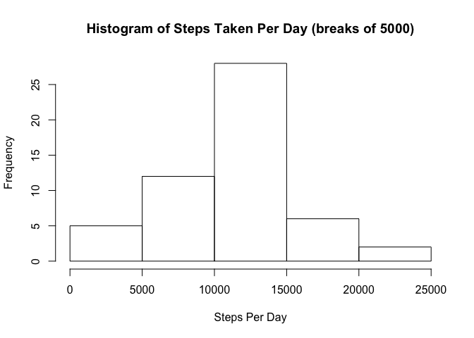

# Reproducible Research: Peer Assessment 1


## Loading and preprocessing the data

The code for this analysis assumes that `activity.zip` is located in the local
git repo and then uses R's functions to extract it and load the csv to a data
frame


```r
setwd('~/RepData_PeerAssessment1/')
unzip('activity.zip')
fitness_df <- read.csv('activity.csv')
```

This produces a data frame with the following fields.


```r
head(fitness_df)
```

```
##   steps       date interval
## 1    NA 2012-10-01        0
## 2    NA 2012-10-01        5
## 3    NA 2012-10-01       10
## 4    NA 2012-10-01       15
## 5    NA 2012-10-01       20
## 6    NA 2012-10-01       25
```

```r
summary(fitness_df)
```

```
##      steps                date          interval     
##  Min.   :  0.00   2012-10-01:  288   Min.   :   0.0  
##  1st Qu.:  0.00   2012-10-02:  288   1st Qu.: 588.8  
##  Median :  0.00   2012-10-03:  288   Median :1177.5  
##  Mean   : 37.38   2012-10-04:  288   Mean   :1177.5  
##  3rd Qu.: 12.00   2012-10-05:  288   3rd Qu.:1766.2  
##  Max.   :806.00   2012-10-06:  288   Max.   :2355.0  
##  NA's   :2304     (Other)   :15840
```


## What is mean total number of steps taken per day?

Producing a histogram requires getting all of the days in question by date 
and then creating sums of the total steps in each. I use the base R `aggregate`


```r
steps_day_df <- aggregate(steps~date, sum, data=fitness_df)
head(steps_day_df)
```

```
##         date steps
## 1 2012-10-02   126
## 2 2012-10-03 11352
## 3 2012-10-04 12116
## 4 2012-10-05 13294
## 5 2012-10-06 15420
## 6 2012-10-07 11015
```

Some days had no data, so they are **not** included as imputed data points per 
instructions.

This produces a histogram as follows.

```r
hist(steps_day_df$steps, xlab='Steps Per Day', main='Histogram of Steps Taken Per Day (breaks of 5000)')
```

<!-- -->

We see a peak between 10,000 - 15,000 steps per day. 


```r
mean_val <- round(mean(steps_day_df$steps))
med_val <- median(steps_day_df$steps)
```

This produced a mean of 10766 and median of 10765.

## What is the average daily activity pattern?


## Imputing missing values


## Are there differences in activity patterns between weekdays and weekends?
